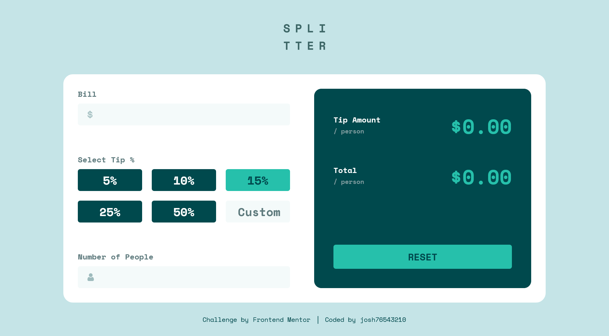

# Frontend Mentor - Tip calculator app solution

This is a solution to the [Tip calculator app challenge on Frontend Mentor](https://www.frontendmentor.io/challenges/tip-calculator-app-ugJNGbJUX). Frontend Mentor challenges help you improve your coding skills by building realistic projects.

## Table of contents

- [Overview](#overview)
  - [The challenge](#the-challenge)
  - [Screenshot](#screenshot)
  - [Links](#links)
- [My process](#my-process)
  - [Built with](#built-with)
  - [What I learned](#what-i-learned)
- [Author](#author)

## Overview

### The challenge

Users should be able to:

- View the optimal layout for the app depending on their device's screen size
- See hover states for all interactive elements on the page
- Calculate the correct tip and total cost of the bill per person

### Screenshot



### Links

- Solution URL: [https://www.frontendmentor.io/solutions/tip-calculator-app-vkBQrHimZ6](https://www.frontendmentor.io/solutions/tip-calculator-app-vkBQrHimZ6)
- Live Site URL: [https://josh76543210-fm-tip-calculator-app.netlify.app/](https://josh76543210-fm-tip-calculator-app.netlify.app/)

## My process

### Built with

- HTML
- CSS
- JavaScript
- Vite

### What I learned

Practice using Vite and JavaScript modules:

To see how you can add code snippets, see below:

```html
<script defer type="module" src="./js/main.js"></script>
```

```js
import calcAmounts from "./calcAmounts";
```

## Author

- GitHub - [@josh76543210](https://github.com/josh76543210)
- Frontend Mentor - [@josh76543210](https://www.frontendmentor.io/profile/josh76543210)
- Twitter - [@josh76543210](https://www.twitter.com/josh76543210)
